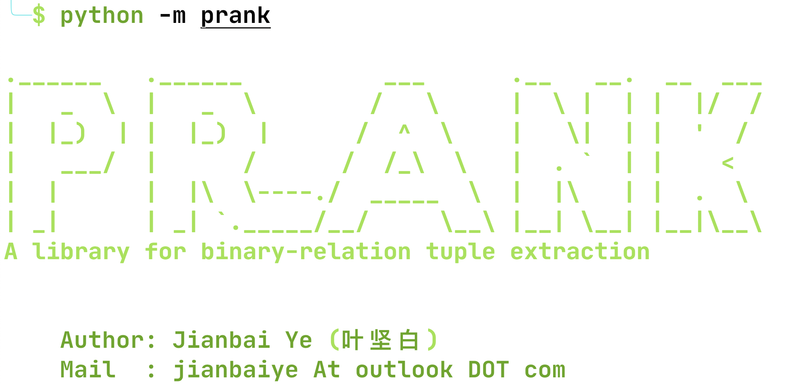

## 

`Prank` is a library for text mining,  especially designed for binary relationship. See all the dependencies in `requirements.txt`.


## What is tuple extraction?

This is an large area in data mining. In general, tuple extraction aims to find similar entity pairs, where we define "similar" as belonging to the same relationship. For example, `(Beijing, China)` is a tuple, where we assume such tuple is from a relationship `is the capital city of`, so we can claim that : `(Washington, USA)` is more similar to `(Beijing, China)` than, let's say, `(Laker, USA)`. Our job is to find such connections.


## A quick tutor of `prank`

We consider a simple text data first:

* relation including: `plus one`, `multiply two`, `square`, `minus one`, `divided by two`
* entities including: integer numbers between [0,50]

(*use `python -m prank.utils` to generate such text data, we name it as `toy.txt`*)

We can have a overview about this `toy.txt`.

```txt
10 square is 100 .
12 multiply two is 24 .
10 plus one is 11 .
28 minus one is 27 .
34 divide two is 17 .
...
```

There are two important abstract in `prank`

* `Pattern`, which represents a text pattern for a binary relationship. For example,

  `#E plus ... is #E` is a pattern for the relationship `plus one`, where `#E` means entity and `...` means wildcards.

  In the `toy.txt`, `#E` in [0, 50]

* `Tuple`, which represents a tuples takes the form of `(#E, #E)`. For example, `(2,4)` is a tuple, which belongs to the relationship `multiply two`, or `square`

(*see more details in `prank.object`*)

#### First step

we need to import the text data and tag it. Thanks to `spaCy`, we can do it really quick and simple.


```python
from prank.object import Docs
mydocs = Docs('./data/toy.txt')
mydocs.initialize()
```
*for the `initialize` method, we can use a keyword `preload` to control the size of text we need, it's useful for some very large data like, `wiki` with more than 6GB text*

#### Second step

we should define a way to search new tuples and patterns from the raw text data, we refer the work [PRDualRank](https://dl.acm.org/doi/10.1145/1935826.1935933) here.


```python
from prank.search import PRDualRankSearch
searcher = PRDualRankSearch(mydocs)
```

Then, we can start to search(bootstrapping) new tuples and patterns, based on the given seed tuples. We use the seed tuples from the relationship `multiply two`


```python
from prank.world import *
from prank.object import Tuple, Pattern

seeds = set([
    Tuple("1", "2", seed=True), Tuple('2', '4', seed=True), 
    Tuple("3", '6', seed=True), Tuple('4', '8', seed=True)
])
# Note that, Tuple and Pattern will automatically record data everytime we instantiate.
# We can use Tuple.tuples() or Pattern.patterns() to access them

propagate_time = 20
for _ in range(propagate_time):
    searcher.fromTuple2Pattern(Tuple.tuples())
    searcher.fromPattern2Tuple(Pattern.patterns(), Tuple.tuples())
print(ystr(f"Found {Pattern.pattern_num()} patterns"))
print(ystr(f"Found {Tuple.tuple_num()} tuples"))

# Found 3 patterns
# Found 49 tuples
```

Let's take a look about those tuples and patterns


```python
print(gstr("Pattern examples:"), Pattern.patterns())
print(gstr("Tuple examples:"), Tuple.tuples()[10:15])
```


<pre style="white-space:pre;overflow-x:auto;line-height:normal;font-family:Menlo,'DejaVu Sans Mono',consolas,'Courier New',monospace"><span style="color: #008000; font-weight: bold">Pattern examples:</span>
<span style="font-weight: bold">[&lt;</span><span style="color: #ff00ff; font-weight: bold">P</span><span style="font-weight: bold">&gt;</span>  #E plus ... is #E , <span style="font-weight: bold">&lt;</span><span style="color: #ff00ff; font-weight: bold">P</span><span style="font-weight: bold">&gt;</span>  #E multiply ... is #E , <span style="font-weight: bold">&lt;</span><span style="color: #ff00ff; font-weight: bold">P</span><span style="font-weight: bold">&gt;</span>  #E square ... is #E <span style="font-weight: bold">]</span>
</pre>

<pre style="white-space:pre;overflow-x:auto;line-height:normal;font-family:Menlo,'DejaVu Sans Mono',consolas,'Courier New',monospace"><span style="color: #008000; font-weight: bold">Tuple examples:</span>
<span style="font-weight: bold">[&lt;</span><span style="color: #ff00ff; font-weight: bold">T</span><span style="font-weight: bold">&gt;</span> <span style="font-weight: bold">(</span><span style="color: #000080; font-weight: bold">7</span>, <span style="color: #000080; font-weight: bold">8</span><span style="font-weight: bold">)</span>, <span style="font-weight: bold">&lt;</span><span style="color: #ff00ff; font-weight: bold">T</span><span style="font-weight: bold">&gt;</span> <span style="font-weight: bold">(</span><span style="color: #000080; font-weight: bold">4</span>, <span style="color: #000080; font-weight: bold">16</span><span style="font-weight: bold">)</span>, <span style="font-weight: bold">&lt;</span><span style="color: #ff00ff; font-weight: bold">T</span><span style="font-weight: bold">&gt;</span> <span style="font-weight: bold">(</span><span style="color: #000080; font-weight: bold">5</span>, <span style="color: #000080; font-weight: bold">10</span><span style="font-weight: bold">)</span>, <span style="font-weight: bold">&lt;</span><span style="color: #ff00ff; font-weight: bold">T</span><span style="font-weight: bold">&gt;</span> <span style="font-weight: bold">(</span><span style="color: #000080; font-weight: bold">8</span>, <span style="color: #000080; font-weight: bold">9</span><span style="font-weight: bold">)</span>, <span style="font-weight: bold">&lt;</span><span style="color: #ff00ff; font-weight: bold">T</span><span style="font-weight: bold">&gt;</span> <span style="font-weight: bold">(</span><span style="color: #000080; font-weight: bold">7</span>, <span style="color: #000080; font-weight: bold">49</span><span style="font-weight: bold">)]</span>
</pre>
So far, we already have a bunch of tuples and patterns that maybe revelant to the relation we interest. What we need to do next is to rank those tuples and patterns

#### Third step

Infer the precision and recall of tuples and patterns, respectively


```python
from prank.inference import PRDualRank
inferor = PRDualRank()

tuples = Tuple.remainTopK(20)

relation = {
    tup : tup.relationship for tup in tuples
}

results = inferor.infer(
    Tuple.tuples(),
    Pattern.patterns(),
    relation,
    seed_tuples=list(seeds),
    max_iter=10
)
```


```python
list(results)
# ['tuple precision', 'pattern precision', 'tuple recall', 'pattern recall']
```


#### The last step

Using the precision and recall to rank tuples, patterns, respectively.
Here we use f1-score to balance both metrics.


```python
from prank.rank import f1_score_rank
top_t, top_p = f1_score_rank(results, inferor)
print(gstr("Top-8 tuples:"), top_t[-8:])
print(gstr("Top-2 patterns:"), top_p[-2:])
```


<pre style="white-space:pre;overflow-x:auto;line-height:normal;font-family:Menlo,'DejaVu Sans Mono',consolas,'Courier New',monospace"><span style="color: #008000; font-weight: bold">Top-</span><span style="color: #008000; font-weight: bold">8</span><span style="color: #008000; font-weight: bold"> tuples:</span>
<span style="font-weight: bold">[</span>
    <span style="font-weight: bold">&lt;</span><span style="color: #ff00ff; font-weight: bold">T</span><span style="font-weight: bold">&gt;</span> <span style="font-weight: bold">(</span><span style="color: #000080; font-weight: bold">15</span>, <span style="color: #000080; font-weight: bold">225</span><span style="font-weight: bold">)</span>,
    <span style="font-weight: bold">&lt;</span><span style="color: #ff00ff; font-weight: bold">T</span><span style="font-weight: bold">&gt;</span> <span style="font-weight: bold">(</span><span style="color: #000080; font-weight: bold">15</span>, <span style="color: #000080; font-weight: bold">16</span><span style="font-weight: bold">)</span>,
    <span style="font-weight: bold">&lt;</span><span style="color: #ff00ff; font-weight: bold">T</span><span style="font-weight: bold">&gt;</span> <span style="font-weight: bold">(</span><span style="color: #000080; font-weight: bold">3</span>, <span style="color: #000080; font-weight: bold">6</span><span style="font-weight: bold">)</span>,
    <span style="font-weight: bold">&lt;</span><span style="color: #ff00ff; font-weight: bold">T</span><span style="font-weight: bold">&gt;</span> <span style="font-weight: bold">(</span><span style="color: #000080; font-weight: bold">4</span>, <span style="color: #000080; font-weight: bold">16</span><span style="font-weight: bold">)</span>,
    <span style="font-weight: bold">&lt;</span><span style="color: #ff00ff; font-weight: bold">T</span><span style="font-weight: bold">&gt;</span> <span style="font-weight: bold">(</span><span style="color: #000080; font-weight: bold">17</span>, <span style="color: #000080; font-weight: bold">34</span><span style="font-weight: bold">)</span>,
    <span style="font-weight: bold">&lt;</span><span style="color: #ff00ff; font-weight: bold">T</span><span style="font-weight: bold">&gt;</span> <span style="font-weight: bold">(</span><span style="color: #000080; font-weight: bold">4</span>, <span style="color: #000080; font-weight: bold">8</span><span style="font-weight: bold">)</span>,
    <span style="font-weight: bold">&lt;</span><span style="color: #ff00ff; font-weight: bold">T</span><span style="font-weight: bold">&gt;</span> <span style="font-weight: bold">(</span><span style="color: #000080; font-weight: bold">24</span>, <span style="color: #000080; font-weight: bold">48</span><span style="font-weight: bold">)</span>,
    <span style="font-weight: bold">&lt;</span><span style="color: #ff00ff; font-weight: bold">T</span><span style="font-weight: bold">&gt;</span> <span style="font-weight: bold">(</span><span style="color: #000080; font-weight: bold">15</span>, <span style="color: #000080; font-weight: bold">30</span><span style="font-weight: bold">)</span>,
<span style="font-weight: bold">]</span>
</pre>

<pre style="white-space:pre;overflow-x:auto;line-height:normal;font-family:Menlo,'DejaVu Sans Mono',consolas,'Courier New',monospace"><span style="color: #008000; font-weight: bold">Top-</span><span style="color: #008000; font-weight: bold">2</span><span style="color: #008000; font-weight: bold"> patterns:</span>
<span style="font-weight: bold">[&lt;</span><span style="color: #ff00ff; font-weight: bold">P</span><span style="font-weight: bold">&gt;</span>  #E square ... is #E , <span style="font-weight: bold">&lt;</span><span style="color: #ff00ff; font-weight: bold">P</span><span style="font-weight: bold">&gt;</span>  #E multiply ... is #E <span style="font-weight: bold">]</span>
</pre>
Finally, we can see the results.
The result is intuitively reasonable. By our inference, we can find some similar tuples from the seed tuples we have, such as `(24, 48)`, `(15,30)`.
But the top tuples still hacv wrong answer, which is easy to understand.
Our seed tuples is from the relation `multiply two`, however there are some seed tuples also satisfy other relationship.

* `(2,4)` also satisfy `square` relationship

* `(1,2)` also satisfy `plus one` relationship  

That's also the diffcults of tuple extraction


